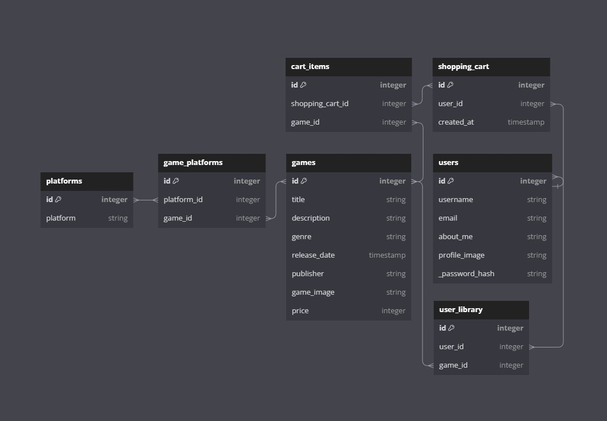
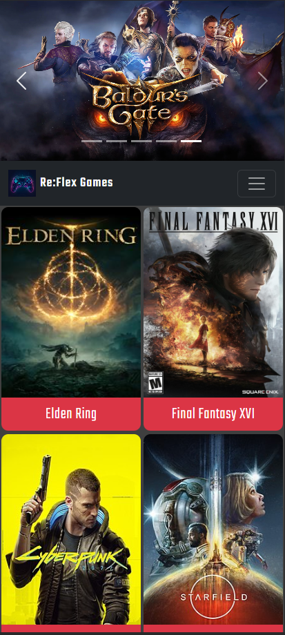
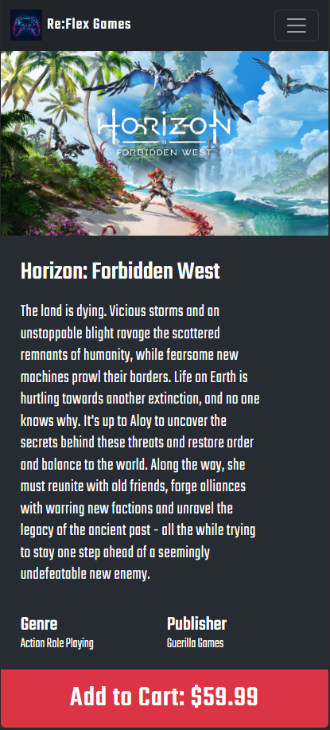
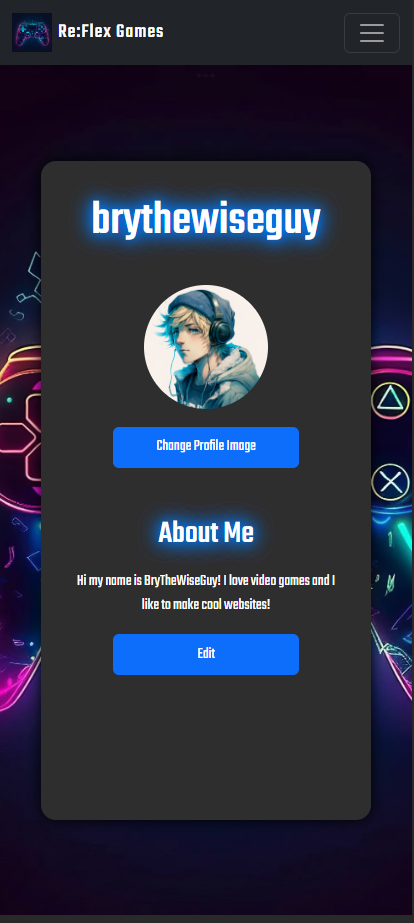
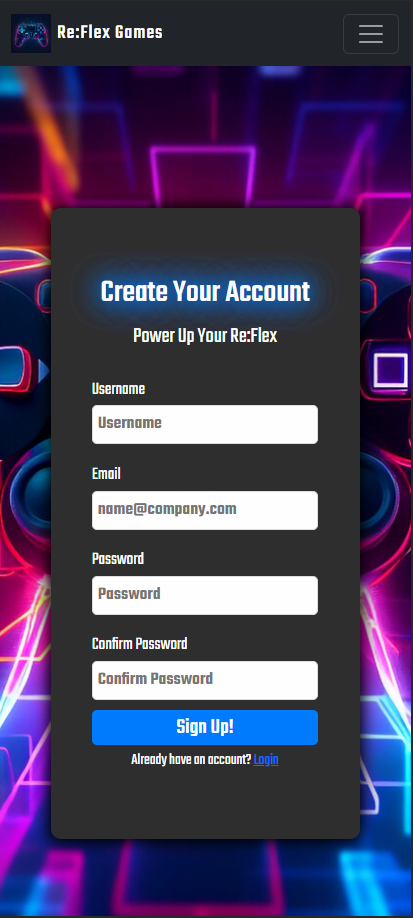

# Re:Flex Games

## Description

Re:Flex Games is a single page web application made with React.js, Python, and Flask-SQLalchemy. This application was specifically designed for mobile first as a retail application for video games. Users are able to visit the website and view available games, create a personalized user profile with an about me and a profile picture, and add games to a shopping cart for purchase. Once games are purchased, the games are then moved into the users game library where the game can be played or removed from the library. No refunds here unforunately! In it's current state, the application does not incorporate any administrative functions to update/modify the available games in the database. This is a feature I plan to add in future builds as I continue developing this project.

## Visuals

### Entity Relationship Diagram

### Application Screenshots

<table>
  <tr>
    <td align="center"></td>
    <td align="center"></td>
    <td align="center"></td>
    <td align="center"></td>
  </tr>
</table>

### Application Showcase Video

**CLICK THE IMAGE!**

## Installation

**NOTE:** Python v3.8, Node.js and `pipenv` are required to use this application. Please see the official Python, Node.js and `pipenv` documentation for instructions on how to ensure these are installed and configured on your machine.

To install and use this application, please follow the steps below:

1. Fork this repository, and clone it to your own local directory
2. Once cloning is complete, navigate to the application directory and run `pipenv install`
    - This should install all required virtual environment dependencies for Python and Flask-SQLAlchemy
3. Next run `npm install --prefix client` to install React dependencies
4. From the root directory, run `pipenv shell` to enter into the Python shell
5. The database should have a fresh seed already applied, but to run a new seed navigate to the `/server` directory and run `python seed.py`
    - **CAUTION:** Running a new database seed will clear out any new data added to the database since the last database seed
6. Once confirmation of the database seed is received, navigate back to the root directory and run `honcho start -f Profile.dev` to start the React App and Database simultaneously
7. **IMPORTANT** This application has only been developed for mobile at this time. To ensure the proper experience, navigate to your broswers developer tools, and switch the view into mobile. This has not been formatted for tablet or desktop screens. 

## Usage

**NOTE:** The following sections will be broken down by individual file, outlining the main purpose of each file and giving short descriptions of each individual function. I've also included Postman Collections for the application for API Endpoint testing where necessary.

## Python/Flask-SQLAlchemy Backend

### `config.py`

This configuration file is responsible for setting up configurations for the backend API, including importing critical dependencies. Special dependencies installed here include Flask Bcrypt for password encryption and dotenv for secret key protection.

### `models.py`

This file contains all table models utilized in the database structure. It includes various imports from `sqlalchemy` to create models, form join tables, and define base models and record entries. There is no Serializer set up in the models file, as this application uses Marshmallow to serialize record entries.

1. `User`
    - This model creates the `users` table and defines base entries. It also sets up the user relationship to the `user_library` and `user_shopping_cart` join tables. It includes password encryption logic through the use of Flask Bcrypt, as well as backend validation logic for `email` and `about_me` data entry.

2. `Game`
    - This model creates the `games` table and defines base entries. It also sets up the game relationship to the `user_library`, `platforms`, and `cart_items` join tables.

3. `UserLibrary`
    - This model creates the `user_library` join table, and sets up foreign key relationships between `Game` and `User` records.

4. `Platform`
    - This model create the `platforms` table and defines base entries. It also sets up the relationship with the `game_platform` join table.

5. `GamePlatform`
    - This model creates the `game_platform` join table, and sets up foreign key relationships between `Game` and `Platform` records.

6. `ShoppingCart`
    - This model creates the `shopping_cart` join table. This is a tri directional join table that sets up foreign key relationships between `User` and `ShoppingCart`, `ShoppingCart` and `CartItem`, `ShoppingCart` and `UserLibrary`.

7. `CartItem`
    - This model creates the `cart_items` join table, and sets up foreign key relationships between `Game` and `ShoppingCart`

### `app.py`

This file utilizes several integral imports to setup serialized schemas and API endpoints, including `flask_restful` and `flask_marshmallow`. This file is broken down into two sections, Model Schemas and API Resources. All table models are imported and utilized in this file to define database interactions for requests to the specified API endpoints. All schemas are defined using Flask-Marshmallow and all API endpoints are defined utilizing Flask-RESTful conventions. Several resources utilize session cookies to ensure users are authorized to view the requested content. This file is responsible for running the bulk of the application processes.
 
For the sake of the length of this README, I am going to make descriptions here very brief. Please utilize my Postman Collections to test and view functionality of the more critical database requests. Additionally, please refer to the Marshmallow documentation for a more in depth explanation of the Schemas defined here. Marshmallow essentially serializes JSON responses and defines what data these responses should include.
 
At the bottom of this file, all api endpoints are list and authorization/authentication functions are defined and combined into a singular function that gets passed to each necessary resource.

1. `UserLogin and UserLogout`
    - These resources are responsible for handling API requests to their respective API endpoints. `UserLogin` utilizes a POST request to login a user on the frontend and set the session cookie. `UserLogout` utilizes a DELETE request to handle the inverse action and remove the session cookie.

2. `UserSignUp`
    - Responsible for the user signup request on the frontend. This is handled through a POST request that pulls data from frontend form entry to be sent to the backend `users` table.

3. `CheckSession`
    - This resource is used in several frontend components to establish authorization through the session cookie. This cookie is set with the users username if one exists.

4. `HomePage`
    - Serves as a placeholder for the database root endpoint.

5. `GamesIndex`
    - Responsible for requesting all games in the `games` table through a GET request. This request is used on frontend application startup to set the state of available games.

6. `GameByID`
    - Responsible for requesting a game by it's specified id. This is utilized on the front end to render information for specific games.

7. `GamePlatform`
    - Responsible for requesting all available game platforms defined in the database. Utilized to create many-to-many relationships between a Game and its respective platforms.

8. `GamePlatformsForGame`
    - Responsible for handling the many-to-many relationships between a game and it's platforms. Can be utilized to request which platforms are available for a specific games.

9. `GamesForPlatform`
    - Serves as the inverse to the previous resource, used to request all games available for a specific platform.

10. `UsersResource`
    - Responsible for requesting all current user accounts.

11. `UserByUsername`
    - Responsible for requesting specific users by their username. Defines 3 requests. PATCH is utilized on the frontend to edit user information such as the "about me" or user profile image. DELETE currently has no frontend functionality, but can be used to delete a user profile.

12. `UserLibraryByUsername`
    - Responsible for requesting data related to the specified user's library. The POST request is used on the frontend to add entries to the users library.

13. `DeleteUserLibraryEntry`
    - Responsible for the deletion of user library records, specified by the game's id. Used on the frontend to delete games from a users library.

14. `UserShoppingCart`
    - Responsible for requesting data related to the user shopping cart and posting record entries to the user shopping cart. Utilized on the frontend to render the user shopping cart.

15. `UserCartItems`
    - Responsible for posting and deleting data related to the items in the user shopping cart. Utilized on the frontend to render shopping cart items and remove items from the shopping cart.

16. `/checkout/<int:cart_id>`
    - This routes sole purpose is to move items from the user shopping cart to the user library

### `seed.py`

This file contains seed data for the database. It seeds 10 different `Game` and 8 different `Platform` models to the database, as well as setting up relationships between each game and their respective platforms. This file does not seed any users. This was designed for first time users using the signup feature to create an account and test out application features.

## React Frontend

### Components

This folder contains all components utilized in the React application, outside of `App.js` and `Index.js` which are located in the `/src` folder. React Router v6 and React-Boostrap were both utilized in the development of this application. `App.js` houses all frontend routes for the application as well as holds state for the user and games. `Index.js` is responsible for rendering the application. I will outline brief explanations of each component in this section. I will not be going over stylesheets or media assets. Each component has it's own stylesheet.

1. `Home.js`
    - Renders the home page, importing the Navbar, GameCarousel, and GameCard components. The games array pulled from state in App.js is used to render separate GameCard components for each game.

2. `NavBar.js`
    - Renders the NavBar component. This component was designed with React-Bootstrap and has conditional rendering depending on the state of the user. It include 2 separate dropdown sections for games and options related to the user if applicable.

3. `GameCarousel`
    - Renders the game carousel seen on the home page. This was also designed with React-Boostrap and renders games based on their id.

4. `GameCard`
    - Renders a game card for each available game on the home page that includes react-bootstrap elements alongside navigation logic through useNavigate to route the user to the specified games page.

5. `Login` and `Signup`
    - These components render their respective pages and include validation logic through the use of Formik. Upon login or signup a user is navigated to their user profile. All forms on these pages are custom designed using CSS.

6. `ProfilePage` and `ProfileCard`
    - Both of these components serve the rendering of the user profile. The `ProfileCard` houses the user about me input field and the profile image submission, which are both able to be edited by the user.

7. `ShoppingCart`
    - Renders the users shopping cart, mapping through all games in the shopping cart and displaying data for each game. Users are able to remove games from the cart and complete their purchase.

8. `UserLibrary`
    - Renders the users library, where the user can view the games they have purchased and delete games from their library if they choose. The play button serves no purpose other than a visual representation of how the application could look if this feature was implemented.

## Acknowledgments

All media assets used in the project were openly sourced from google. I do not own the rights to any of these assets, and therefore do not condone any utilization of these assets that would result in monetary gain.

## Contributing

Pull requests are welcome! Please feel free to reach out to me at if there are specific features you'd like to see implemented!  
For major changes, please reach out to me directly to discuss what you would like to change.  
All pushes to main branch will be made upon my approval.  
Please make sure to run and update tests as appropriate.

## License

MIT License

Copyright (c) 2023 Brian Ashman

Permission is hereby granted, free of charge, to any person obtaining a copy
of this software and associated documentation files (the "Software"), to deal
in the Software without restriction, including without limitation the rights
to use, copy, modify, merge, publish, distribute, sublicense, and/or sell
copies of the Software, and to permit persons to whom the Software is
furnished to do so, subject to the following conditions:

The above copyright notice and this permission notice shall be included in all
copies or substantial portions of the Software.

THE SOFTWARE IS PROVIDED "AS IS", WITHOUT WARRANTY OF ANY KIND, EXPRESS OR
IMPLIED, INCLUDING BUT NOT LIMITED TO THE WARRANTIES OF MERCHANTABILITY,
FITNESS FOR A PARTICULAR PURPOSE AND NONINFRINGEMENT. IN NO EVENT SHALL THE
AUTHORS OR COPYRIGHT HOLDERS BE LIABLE FOR ANY CLAIM, DAMAGES OR OTHER
LIABILITY, WHETHER IN AN ACTION OF CONTRACT, TORT OR OTHERWISE, ARISING FROM,
OUT OF OR IN CONNECTION WITH THE SOFTWARE OR THE USE OR OTHER DEALINGS IN THE
SOFTWARE.
